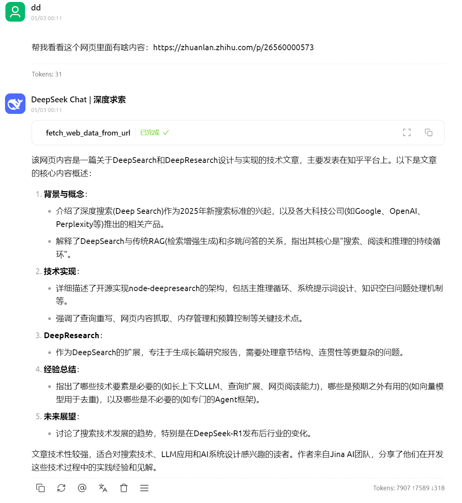

# MCP Websearch

MCP Websearch​​ 是基于 MCP（Model Context Protocol）的网页搜索与内容提取工具，支持通过 Claude 等支持 MCP 的 AI 直接调用网页搜索功能。本工具集成多搜索引擎，具备反爬虫绕过能力，适用于自动化数据采集场景。

## ✨特性

- ​​多引擎支持​​：集成 DuckDuckGo（DDGS）、Bing、Google、Baidu 等主流搜索引擎
- ​零API依赖​​：直接爬取搜索引擎结果，无需配置API密钥
- ​智能反爬​​：内置请求频率控制与浏览器特征模拟（User-Agent轮换等）
- ​内容提取​​：支持网页正文、元数据、原始HTML等多维度数据提取
- ​多语言适配​​：完美支持中英文搜索结果，自动识别网页编码
- ​AI友好​​：专为 Claude 等AI工具设计的数据返回格式（Pydantic Models）

## 🚀 快速安装

#### 环境要求

- Python 3.11+
- Playwright（自动浏览器管理）

#### 克隆仓库

```bash
# 克隆仓库
git clone https://github.com/wdndev/mcp_websearch.git
cd mcp_websearch

# 安装 UV 包管理器（跨平台）
curl -LsSf https://astral.sh/uv/install.sh | sh  # Linux/macOS
# 或 Windows PowerShell:
irm https://astral.sh/uv/install.ps1 | iex

# 创建虚拟环境并安装依赖
uv venv --python 3.11
uv sync

# 安装依赖
playwright install
```

## 🛠 使用指南

#### 环境激活

```bash
# Linux & MAC
source .venv/bin/activate

# Windows
./.venv/Scripts/activate

```

#### MCP 服务配置

1. 找到 MCP 配置文件（例如 .cursor/mcp.json）
2. 添加服务器配置：
```json
{
    "mcpServers": {
        "web_search": {
            "name": "MCP Websearch Service",
            "type": "stdio",
            "description": "网页搜索与内容提取服务",
            "command": "uv",
            "args": [
            "--directory",
            "/<absolute-path>/mcp_websearch",
            "run",
            "search_server.py"
            ]
        },
    },
}
```
3. 现在可以在 MCP 客户端中使用 `fetch_web_data_from_url` , `search_web_data_from_query`和 `fetch_web_data_from_query` 工具了

#### Demo



## 支持的工具

#### search_web_data_from_query

根据用户 query 获取网页内容。支持: ddgs, bing, baidu, google 搜索引擎

参数：
- query: 用户 query
- num_results: 获取网页内容的数量, 默认为 5
- search_type: 搜索类型，可选值：ddgs, bing, baidu, google

返回值：`WebSearchResult` 列表对象

```bash
[
    WebSearchResult(
        url: str
        title: Optional[str] = None
        position: Optional[int] = None
        description: Optional[str] = None
        metadata: Optional[Any] = None
    )
]
```

#### fetch_web_data_from_url

根据用户 url 获取网页内容。

参数：
- url: 用户 url
  
返回值：`WebScrapeResult` 对象

```bash
WebScrapeResult(
    title: str,
    url: str,
    text: str,
    html: Optional[str],
    source: Optional[str]
)
```


#### fetch_web_data_from_query

根据用户 query 获取网页内容。支持: ddgs, bing, baidu, google 搜索引擎

参数：
- query: 用户 query
- num_results: 获取网页内容的数量, 默认为 5
- search_type: 搜索类型，可选值：ddgs, bing, baidu, google

返回值：`WebScrapeResult` 列表对象

```python
[
    WebScrapeResult(
        title: str,
        url: str,
        text: str,
        html: Optional[str],
        source: Optional[str]
    )
]
```


## 注意

1. ​反爬策略​​：
   - 遇到反爬时可尝试：
        - 切换搜索引擎类型
        - 减少并发请求量
        - 在配置中启用 Playwright 渲染模式
2. ​合法使用​​：
    - 本工具仅限用于合法数据采集场景
    - 请遵守各搜索引擎的 robots.txt 协议
    - 禁止用于商业数据爬取等违规用途

3. ​性能建议​​：
    - 推荐使用 DDGS 引擎获取即时数据
    - 批量采集时建议设置 2-3 秒请求间隔
   - 对动态网页建议启用 HTML 缓存功能

## 许可证

MIT


